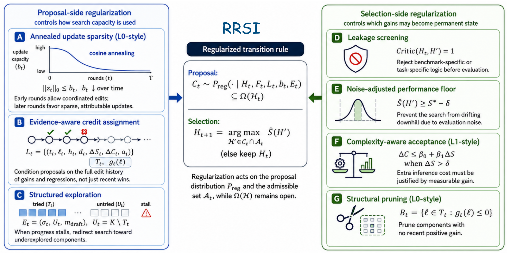

# RRSI: Regularized Recursive Self-Improvement of Agent Harnesses

Check out our [paper](#citation) for more details.

## Updates

- [2026-09] Initial release.

## Overview

<p align="center">
  
</p>

An LLM agent's capability is largely set by its harness: the prompts, control
flow, tools, memory and context management around a frozen model. Evolving the
harness against a fixed evolve set is effective but overfits: the harness
memorizes the training tasks, and large in-distribution gains shrink or vanish
out of distribution. RRSI keeps the harness edit space open and regularizes the
search trajectory through it instead.

On the proposal side, an annealed budget caps how many independent edits one
candidate may bundle, the proposer is conditioned on the full edit history so a
falsified hypothesis is not redrawn, and a stalled run is redirected toward
components it has never exercised. On the selection side, a critic screens
every candidate for suite-specific logic before it is evaluated, a
noise-adjusted floor blocks gains within evaluation variance, a cost rule
requires added inference tokens to be paid for by measured gain, and
components that stop helping are pruned.

### Key features

* **Open edit space, regularized search.** Prompts, control flow, configuration, context management, tools, skills, memory and sub-agents may all be modified; the constraints act on how the search moves, not on what the harness may contain.
* **One method, three instances.** The same loop drives a terminal agent (Terminal-Bench 2.1), a document-work agent (Harvey LAB) and an engineering-design agent (EngDesign); each instance is a `Domain` adapter plus its starting harness.
* **Candidates in git worktrees.** Every candidate harness is drafted, screened and evaluated in its own worktree on a branch off `evolve/<domain>`; accepting one fast-forwards the branch, so the incumbent is always a commit.
* **Evidence you can audit.** The edit history records, per edit, the component, the hypothesis, the measured score and cost change and the verdict; the prompts the proposer, analyst and critic receive are plain files in `domains/<name>/`.

## Layout

```
rrsi/                  the method: Algorithm 1 (proposal side) and Algorithm 2 (selection side)
rrsi.py                command line
domains/coding/        Terminal-Bench 2.1 instance (harbor); OOD: SWE-bench Verified
domains/workspace/           Harvey LAB instance; OOD: JobBench, GDPval, APEX-Agents
domains/eng/           EngDesign instance; OOD: EngDesign v1 (hardened), Frontier-Eng
third_party/           the starting harnesses H_0 and the engines they run on (see the METADATA files)
tests/                 unit tests of the method core
```

Each domain directory holds a `Domain` adapter (how the harness is run,
scored, rendered and screened for leakage), the constitution the proposer
reads (`SKILL.md`, `PATTERNS.md`), the hyperparameters (`rrsi.json`), the
task split and a README with its prerequisites and commands.

The starting harnesses are third-party code and live under `third_party/`:
the Terminus-2 agent from harbor (`harbor_terminus2/`, coding) and the
react_toolbelt agent from archipelago (`archipelago/harness_workspace/`,
`archipelago/harness_eng/`) on the archipelago runner
(`archipelago/runner/`). RRSI edits these directories on a per-domain git
branch `evolve/<domain>`.

## Method to code

| Paper | Code |
|---|---|
| Empirical score and cost estimate | `rrsi/evaluate.py: aggregate` (weighted per-trial rewards; a missing trial counts 0 with the full denominator) |
| Annealed edit budget b_t | `rrsi/schedule.py: edit_budget`, enforced in the proposer's done() |
| Edit history L_t, tried set T_t, recent yield g_t | `rrsi/history.py: History` (one JSONL record per edit) |
| Stall flag, untried components, exploration directives | `rrsi/history.py: stall_flag, exploration`; reserved slots enforced in `rrsi/propose.py` |
| Analyze(H_t, D) | `rrsi/analyst.py` dispatching `rrsi/digester.py` |
| Proposer with (component, hypothesis, diff) tags | `rrsi/propose.py`; tags validated against the diff by `rrsi/components.py` |
| Critic (leakage screen before evaluation) | `rrsi/critic.py` (domain regex denylist plus LLM review, bounded repair) |
| Evaluate in parallel | `rrsi/evaluate.py`, `Run.round` thread pool |
| Noise-adjusted floor, cost rule, shaped rule, argmax | `rrsi/selection.py` |
| Prune set B_t | `History.prune_set`, handed to the proposer with the accepted machinery to remove |
| Noise band delta | fixed per instance in `rrsi.json` (0.017 / 0.004 / 0.020); `rrsi/calibrate.py` re-estimates it when `delta` is `null` (bootstrap over trials of the base evaluation, or repeated base evaluations) |
| Non-compensatory domain criteria | `Domain.guards` (engineering: valid-rate drop, no-submission rise) |

## Quickstart

### 0. LLM configuration

The proposer, analyst and critic call Claude on Vertex AI through Application
Default Credentials; the policy model of each instance is a LiteLLM model
string (`policy_model` in `rrsi.json`) and is called the same way.

```bash
gcloud auth application-default login
export RRSI_VERTEX_PROJECTS="your-project-id"          # comma-separated list is spread round-robin
export VERTEX_PROJECT="your-project-id" VERTEXAI_PROJECT="your-project-id"
export VERTEX_LOCATION=global VERTEXAI_LOCATION=global
export RRSI_AGENT_PYTHON=/path/to/venv/bin/python       # runner environment for the workspace and eng instances
pip install -e ".[dev]"                                 # the core; see the domain READMEs for the runners
```

### 1. Run an instance

```bash
python3 rrsi.py --domain eng smoke              # liveness: compile, construct, a few tasks
python3 rrsi.py --domain eng baseline           # Evaluate(H_0), seed the frontier, calibrate delta
python3 rrsi.py --domain eng round --t 0 --dry-run
python3 rrsi.py --domain eng run                # rounds 0..T-1, resumable; touch runs/eng/STOP to stop
python3 rrsi.py --domain eng status
python3 rrsi.py --domain eng readjudicate --t 3 # re-apply Algorithm 2 to a stored round after a delta or weight change
python3 rrsi.py --domain eng reevaluate --t 3   # re-measure a round's candidates after an infrastructure failure
```

Hyperparameters live in `domains/<name>/rrsi.json`; any of them can be
overridden on the command line (`--T`, `--k`, `--m`, `--b-max`, `--delta`,
`--beta1`, ...). Scores are fractions in [0, 1] and the cost change is relative
token growth, so `beta0 = 0.10, beta1 = 44.5` reads "10% more tokens for free,
then 25% per pass on an 89-task, k = 2 evolve set". `delta` is the empirical
noise tolerance of each instance; set it to `null` to have `calibrate` re-estimate
it as `delta_z` standard deviations of the null score difference. `runs/<domain>/` holds
the frontier (incumbent, best score, score trajectory), the edit history, the
noise calibration, the per-round artifacts and the raw trials.

Per-instance prerequisites and out-of-distribution evaluation are described in
`domains/coding/README.md`, `domains/workspace/README.md` and
`domains/eng/README.md`.

## Adding a domain

A domain is one module, `domains/<name>/adapter.py`, exporting `DOMAIN`, an
instance of `rrsi.domain.Domain` that implements:

* `evolve_ids`, `heldout_ids`, `smoke_ids`: the task splits;
* `run(root, runs_dir, job, ids, k)` and `score(runs_dir, job, ids, k)`: run the harness checked out under `root` and return per-task trial rewards (Evaluate);
* `load_trial`, `render_trace`, `task_row`: the evidence the analyst, digester and proposer read;
* `smoke`: a liveness check of a candidate before it is evaluated;
* `critic_patterns`, `component_signals`, `briefs`, `guards`: the domain's leakage denylist, diff-to-component signals, role prompts and non-compensatory acceptance criteria;

plus `harness_path` (the evolvable directory), `SKILL.md` and `PATTERNS.md`
(the proposer's constitution) and `rrsi.json` (hyperparameters). The core
never reads a trajectory format or a benchmark directory itself.

## Tests

```bash
python3 -m pytest tests            # or: python3 tests/test_core.py
```

## Acknowledgements

The initial harnesses are the Terminus-2 agent from [harbor](https://github.com/laude-institute/harbor) and the react_toolbelt agent and runner from [archipelago](https://github.com/Mercor-Intelligence/archipelago). The instances evaluate on [Terminal-Bench](https://github.com/harbor-framework/terminal-bench), [SWE-bench Verified](https://github.com/SWE-bench/SWE-bench), [Harvey LAB](https://github.com/harveyai/harvey-labs), [JobBench](https://github.com/Job-Bench/job-bench-eval), [GDPval](https://openai.com/index/gdpval/), [APEX-Agents](https://www.mercor.com/apex/apex-agents-leaderboard/), [EngDesign](https://github.com/AGI4Engineering/EngDesign) and [Frontier-Eng](https://github.com/Einsia/Frontier-Engineering).

## Citation

```bibtex
@article{xia2026rrsi,
  title  = {RRSI: Regularized Recursive Self-Improvement of Agent Harnesses},
  author = {Xia, Peng and Han, Rujun and Wang, Zifeng and Chen, Yanfei and Zhuang, Yufan and Lee, Yoonho and Huang, Chengsong and Yu, Han and CuiZhu, Zhongying and Ming, Yifei and Yao, Huaxiu and Gokturk, Burak and Pfister, Tomas and Lee, Chen-Yu},
  journal={arXiv preprint arXiv:2609.xxxxx},
  year   = {2026}
}
```

## Contributing

See [CONTRIBUTING.md](CONTRIBUTING.md).

## License

Apache 2.0; see [LICENSE](LICENSE). Third-party code under `third_party/`
carries its own license and METADATA.

## Disclaimer

This is not an officially supported Google product. This project is not
eligible for the
[Google Open Source Software Vulnerability Rewards Program](https://bughunters.google.com/open-source-security).
